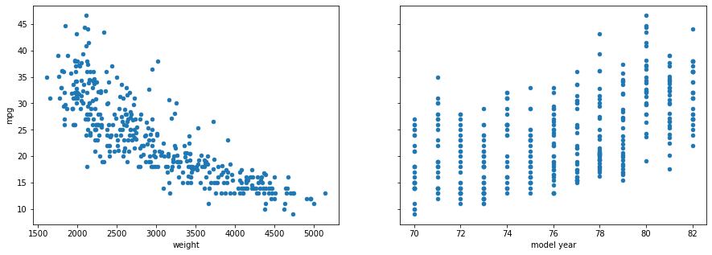
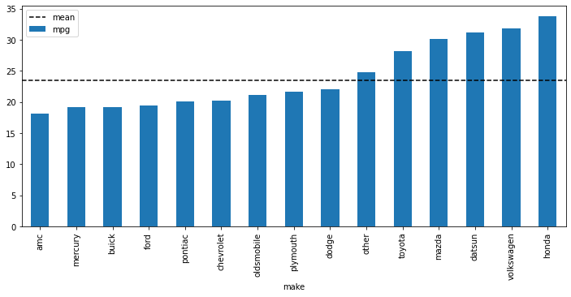

# Interpreting One-Hot Encoded Coefficients

## Introduction

You have already seen some examples of how to interpret coefficients for multiple linear regression. In this lesson we will go over some more examples, particularly focusing on models with one-hot encoded categorical predictors.

## Objectives

You will be able to:

* Describe and apply the concept of a reference category
* Interpret coefficients for one-hot encoded variables
* Explain the implications of binning and dropping multiple categories with one-hot encoded variables

## Reference Categories

Let's look at the Auto MPG dataset, with an engineered `make` feature. Then we'll start with a multiple regression model that uses `weight`, `model year`, and `origin` to predict `mpg`.


```python
import pandas as pd

# Load data into pandas and engineer "make" feature
data = pd.read_csv("auto-mpg.csv")
data["make"] = data["car name"].str.split().apply(lambda x: x[0])

# Prepare y and X for modeling
y = data["mpg"]
X = data[["weight", "model year", "origin"]]
X = pd.get_dummies(X, columns=["origin"], drop_first=True) # origin is categorical
X
```


<div>
<style scoped>
    .dataframe tbody tr th:only-of-type {
        vertical-align: middle;
    }

    .dataframe tbody tr th {
        vertical-align: top;
    }

    .dataframe thead th {
        text-align: right;
    }
</style>
<table border="1" class="dataframe">
  <thead>
    <tr style="text-align: right;">
      <th></th>
      <th>weight</th>
      <th>model year</th>
      <th>origin_2</th>
      <th>origin_3</th>
    </tr>
  </thead>
  <tbody>
    <tr>
      <th>0</th>
      <td>3504</td>
      <td>70</td>
      <td>0</td>
      <td>0</td>
    </tr>
    <tr>
      <th>1</th>
      <td>3693</td>
      <td>70</td>
      <td>0</td>
      <td>0</td>
    </tr>
    <tr>
      <th>2</th>
      <td>3436</td>
      <td>70</td>
      <td>0</td>
      <td>0</td>
    </tr>
    <tr>
      <th>3</th>
      <td>3433</td>
      <td>70</td>
      <td>0</td>
      <td>0</td>
    </tr>
    <tr>
      <th>4</th>
      <td>3449</td>
      <td>70</td>
      <td>0</td>
      <td>0</td>
    </tr>
    <tr>
      <th>...</th>
      <td>...</td>
      <td>...</td>
      <td>...</td>
      <td>...</td>
    </tr>
    <tr>
      <th>387</th>
      <td>2790</td>
      <td>82</td>
      <td>0</td>
      <td>0</td>
    </tr>
    <tr>
      <th>388</th>
      <td>2130</td>
      <td>82</td>
      <td>1</td>
      <td>0</td>
    </tr>
    <tr>
      <th>389</th>
      <td>2295</td>
      <td>82</td>
      <td>0</td>
      <td>0</td>
    </tr>
    <tr>
      <th>390</th>
      <td>2625</td>
      <td>82</td>
      <td>0</td>
      <td>0</td>
    </tr>
    <tr>
      <th>391</th>
      <td>2720</td>
      <td>82</td>
      <td>0</td>
      <td>0</td>
    </tr>
  </tbody>
</table>
<p>392 rows × 4 columns</p>
</div>


```python
import statsmodels.api as sm

model = sm.OLS(y, sm.add_constant(X))
results = model.fit()

print(results.summary())
```

                                OLS Regression Results                            
    ==============================================================================
    Dep. Variable:                    mpg   R-squared:                       0.819
    Model:                            OLS   Adj. R-squared:                  0.817
    Method:                 Least Squares   F-statistic:                     437.9
    Date:                Thu, 12 May 2022   Prob (F-statistic):          3.53e-142
    Time:                        15:26:52   Log-Likelihood:                -1026.1
    No. Observations:                 392   AIC:                             2062.
    Df Residuals:                     387   BIC:                             2082.
    Df Model:                           4                                         
    Covariance Type:            nonrobust                                         
    ==============================================================================
                     coef    std err          t      P>|t|      [0.025      0.975]
    ------------------------------------------------------------------------------
    const        -18.3069      4.017     -4.557      0.000     -26.205     -10.409
    weight        -0.0059      0.000    -22.647      0.000      -0.006      -0.005
    model year     0.7698      0.049     15.818      0.000       0.674       0.866
    origin_2       1.9763      0.518      3.815      0.000       0.958       2.995
    origin_3       2.2145      0.519      4.268      0.000       1.194       3.235
    ==============================================================================
    Omnibus:                       32.293   Durbin-Watson:                   1.251
    Prob(Omnibus):                  0.000   Jarque-Bera (JB):               58.234
    Skew:                           0.507   Prob(JB):                     2.26e-13
    Kurtosis:                       4.593   Cond. No.                     7.39e+04
    ==============================================================================
    
    Notes:
    [1] Standard Errors assume that the covariance matrix of the errors is correctly specified.
    [2] The condition number is large, 7.39e+04. This might indicate that there are
    strong multicollinearity or other numerical problems.


In the model displayed above, we have dropped one of the dummy variable columns for `origin`, in order to avoid the **dummy variable trap**. The dropped column is now our **reference category**.

So, which column is that?

To investigate this, we need to look at the values of `origin` prior to one-hot encoding:


```python
data["origin"].value_counts()
```


    1    245
    3     79
    2     68
    Name: origin, dtype: int64


(`1` means a US car maker, `2` means a European car maker, `3` means an Asian car maker.)

Because `1` does not appear in our one-hot encoded variable (we only have `origin_2` and `origin_3`), we know that **`1` is the reference category**. Thus we can interpret the coefficients of `origin_2` and `origin_2` like this:

* `origin_2` means the difference associated with a car being from a European car maker vs. a US car maker. In other words, compared to US car makers, we see an associated increase of about 2 MPG for European car makers.
* `origin_3` means the difference associated with a car being from an Asian car maker vs. a US car maker. We see an associated increase of about 2.2 MPG for Asian car makers compared to US car makers.

### Alternative Reference Categories

When you run `pd.get_dummies` and specify `drop_first=True`, this is an easy way to make sure that you avoid the dummy variable trap and that _some_ category is selected as the reference category. However there is no data understanding involved; pandas just chooses the first category (alphabetically) that it finds.

If we skip that argument and manually drop a column instead, we can easily set any category as the reference category.

For example, if we set `2` (European car maker) as the reference category, our model looks like this:


```python
X = data[["weight", "model year", "origin"]]
X = pd.get_dummies(X, columns=["origin"])
X = X.drop("origin_2", axis=1)
X
```


<div>
<style scoped>
    .dataframe tbody tr th:only-of-type {
        vertical-align: middle;
    }

    .dataframe tbody tr th {
        vertical-align: top;
    }

    .dataframe thead th {
        text-align: right;
    }
</style>
<table border="1" class="dataframe">
  <thead>
    <tr style="text-align: right;">
      <th></th>
      <th>weight</th>
      <th>model year</th>
      <th>origin_1</th>
      <th>origin_3</th>
    </tr>
  </thead>
  <tbody>
    <tr>
      <th>0</th>
      <td>3504</td>
      <td>70</td>
      <td>1</td>
      <td>0</td>
    </tr>
    <tr>
      <th>1</th>
      <td>3693</td>
      <td>70</td>
      <td>1</td>
      <td>0</td>
    </tr>
    <tr>
      <th>2</th>
      <td>3436</td>
      <td>70</td>
      <td>1</td>
      <td>0</td>
    </tr>
    <tr>
      <th>3</th>
      <td>3433</td>
      <td>70</td>
      <td>1</td>
      <td>0</td>
    </tr>
    <tr>
      <th>4</th>
      <td>3449</td>
      <td>70</td>
      <td>1</td>
      <td>0</td>
    </tr>
    <tr>
      <th>...</th>
      <td>...</td>
      <td>...</td>
      <td>...</td>
      <td>...</td>
    </tr>
    <tr>
      <th>387</th>
      <td>2790</td>
      <td>82</td>
      <td>1</td>
      <td>0</td>
    </tr>
    <tr>
      <th>388</th>
      <td>2130</td>
      <td>82</td>
      <td>0</td>
      <td>0</td>
    </tr>
    <tr>
      <th>389</th>
      <td>2295</td>
      <td>82</td>
      <td>1</td>
      <td>0</td>
    </tr>
    <tr>
      <th>390</th>
      <td>2625</td>
      <td>82</td>
      <td>1</td>
      <td>0</td>
    </tr>
    <tr>
      <th>391</th>
      <td>2720</td>
      <td>82</td>
      <td>1</td>
      <td>0</td>
    </tr>
  </tbody>
</table>
<p>392 rows × 4 columns</p>
</div>


```python
model = sm.OLS(y, sm.add_constant(X))
results = model.fit()

results.params
```


    const        -16.330638
    weight        -0.005887
    model year     0.769849
    origin_1      -1.976306
    origin_3       0.238228
    dtype: float64


Or if we set `3` (Asian car maker) as the reference category, our model looks like this:


```python
X = data[["weight", "model year", "origin"]]
X = pd.get_dummies(X, columns=["origin"])
X = X.drop("origin_3", axis=1)
X
```


<div>
<style scoped>
    .dataframe tbody tr th:only-of-type {
        vertical-align: middle;
    }

    .dataframe tbody tr th {
        vertical-align: top;
    }

    .dataframe thead th {
        text-align: right;
    }
</style>
<table border="1" class="dataframe">
  <thead>
    <tr style="text-align: right;">
      <th></th>
      <th>weight</th>
      <th>model year</th>
      <th>origin_1</th>
      <th>origin_2</th>
    </tr>
  </thead>
  <tbody>
    <tr>
      <th>0</th>
      <td>3504</td>
      <td>70</td>
      <td>1</td>
      <td>0</td>
    </tr>
    <tr>
      <th>1</th>
      <td>3693</td>
      <td>70</td>
      <td>1</td>
      <td>0</td>
    </tr>
    <tr>
      <th>2</th>
      <td>3436</td>
      <td>70</td>
      <td>1</td>
      <td>0</td>
    </tr>
    <tr>
      <th>3</th>
      <td>3433</td>
      <td>70</td>
      <td>1</td>
      <td>0</td>
    </tr>
    <tr>
      <th>4</th>
      <td>3449</td>
      <td>70</td>
      <td>1</td>
      <td>0</td>
    </tr>
    <tr>
      <th>...</th>
      <td>...</td>
      <td>...</td>
      <td>...</td>
      <td>...</td>
    </tr>
    <tr>
      <th>387</th>
      <td>2790</td>
      <td>82</td>
      <td>1</td>
      <td>0</td>
    </tr>
    <tr>
      <th>388</th>
      <td>2130</td>
      <td>82</td>
      <td>0</td>
      <td>1</td>
    </tr>
    <tr>
      <th>389</th>
      <td>2295</td>
      <td>82</td>
      <td>1</td>
      <td>0</td>
    </tr>
    <tr>
      <th>390</th>
      <td>2625</td>
      <td>82</td>
      <td>1</td>
      <td>0</td>
    </tr>
    <tr>
      <th>391</th>
      <td>2720</td>
      <td>82</td>
      <td>1</td>
      <td>0</td>
    </tr>
  </tbody>
</table>
<p>392 rows × 4 columns</p>
</div>


```python
model = sm.OLS(y, sm.add_constant(X))
results = model.fit()

results.params
```


    const        -16.092410
    weight        -0.005887
    model year     0.769849
    origin_1      -2.214534
    origin_2      -0.238228
    dtype: float64


Looking at the models above, what changes and what stays the same, in terms of the coefficients? Why?

---

<details>
    <summary style="cursor: pointer"><b>Answer (click to reveal)</b></summary>
    
Each time the reference category changes, the `const` and the other `origin` coefficients change.

`const` changes because it represents the value when _all_ predictors are 0, and this means that `const` represents when the reference category is true.

The other `origin` coefficients change because they are always with respect to the reference category. So if the category `1` has been dropped, then `origin_2` is with respect to category `1`. But if category `3` has been dropped instead, then `origin_2` is with respect to category `3`.

`weight` and `model year` don't change, because the `origin` overall is still being "held constant" by the model, regardless of how `origin` is actually encoded.

</details>

### Choosing a Reference Category

Choosing an appropriate reference category comes down to your understanding of the data and the stakeholders. Is there a category that makes the most sense as a "baseline", "default", or "neutral" category?

For our `origin` category, if you were performing this analysis in the US, then setting `origin_1` as the baseline might make the most sense. If your audience were in Europe or Asia, then it might make more sense to drop `origin_2` or `origin_3`. For a context without a clear match like this, you might choose the category that is most familiar or most well-known to your audience.

You also might consider looking at the data itself to see what makes the most sense as a "baseline". If one category is much more common than the others, that might be a good baseline. Or if one category is in the "middle" (maybe closest to the mean or median) in terms of the target, that also might be a good baseline.

**There is no single right answer for choosing a reference category.** The model contains the same information regardless of which category is chosen, so you are really just deciding how best to interpret your coefficients.

## Predictors with More Categories

The category `origin` only has three options for a reference category, since there are only three different values present in that column.

What about `make`, which contains many more categories?


```python
pd.get_dummies(data["make"])
```


<div>
<style scoped>
    .dataframe tbody tr th:only-of-type {
        vertical-align: middle;
    }

    .dataframe tbody tr th {
        vertical-align: top;
    }

    .dataframe thead th {
        text-align: right;
    }
</style>
<table border="1" class="dataframe">
  <thead>
    <tr style="text-align: right;">
      <th></th>
      <th>amc</th>
      <th>audi</th>
      <th>bmw</th>
      <th>buick</th>
      <th>cadillac</th>
      <th>capri</th>
      <th>chevroelt</th>
      <th>chevrolet</th>
      <th>chevy</th>
      <th>chrysler</th>
      <th>...</th>
      <th>renault</th>
      <th>saab</th>
      <th>subaru</th>
      <th>toyota</th>
      <th>toyouta</th>
      <th>triumph</th>
      <th>vokswagen</th>
      <th>volkswagen</th>
      <th>volvo</th>
      <th>vw</th>
    </tr>
  </thead>
  <tbody>
    <tr>
      <th>0</th>
      <td>0</td>
      <td>0</td>
      <td>0</td>
      <td>0</td>
      <td>0</td>
      <td>0</td>
      <td>0</td>
      <td>1</td>
      <td>0</td>
      <td>0</td>
      <td>...</td>
      <td>0</td>
      <td>0</td>
      <td>0</td>
      <td>0</td>
      <td>0</td>
      <td>0</td>
      <td>0</td>
      <td>0</td>
      <td>0</td>
      <td>0</td>
    </tr>
    <tr>
      <th>1</th>
      <td>0</td>
      <td>0</td>
      <td>0</td>
      <td>1</td>
      <td>0</td>
      <td>0</td>
      <td>0</td>
      <td>0</td>
      <td>0</td>
      <td>0</td>
      <td>...</td>
      <td>0</td>
      <td>0</td>
      <td>0</td>
      <td>0</td>
      <td>0</td>
      <td>0</td>
      <td>0</td>
      <td>0</td>
      <td>0</td>
      <td>0</td>
    </tr>
    <tr>
      <th>2</th>
      <td>0</td>
      <td>0</td>
      <td>0</td>
      <td>0</td>
      <td>0</td>
      <td>0</td>
      <td>0</td>
      <td>0</td>
      <td>0</td>
      <td>0</td>
      <td>...</td>
      <td>0</td>
      <td>0</td>
      <td>0</td>
      <td>0</td>
      <td>0</td>
      <td>0</td>
      <td>0</td>
      <td>0</td>
      <td>0</td>
      <td>0</td>
    </tr>
    <tr>
      <th>3</th>
      <td>1</td>
      <td>0</td>
      <td>0</td>
      <td>0</td>
      <td>0</td>
      <td>0</td>
      <td>0</td>
      <td>0</td>
      <td>0</td>
      <td>0</td>
      <td>...</td>
      <td>0</td>
      <td>0</td>
      <td>0</td>
      <td>0</td>
      <td>0</td>
      <td>0</td>
      <td>0</td>
      <td>0</td>
      <td>0</td>
      <td>0</td>
    </tr>
    <tr>
      <th>4</th>
      <td>0</td>
      <td>0</td>
      <td>0</td>
      <td>0</td>
      <td>0</td>
      <td>0</td>
      <td>0</td>
      <td>0</td>
      <td>0</td>
      <td>0</td>
      <td>...</td>
      <td>0</td>
      <td>0</td>
      <td>0</td>
      <td>0</td>
      <td>0</td>
      <td>0</td>
      <td>0</td>
      <td>0</td>
      <td>0</td>
      <td>0</td>
    </tr>
    <tr>
      <th>...</th>
      <td>...</td>
      <td>...</td>
      <td>...</td>
      <td>...</td>
      <td>...</td>
      <td>...</td>
      <td>...</td>
      <td>...</td>
      <td>...</td>
      <td>...</td>
      <td>...</td>
      <td>...</td>
      <td>...</td>
      <td>...</td>
      <td>...</td>
      <td>...</td>
      <td>...</td>
      <td>...</td>
      <td>...</td>
      <td>...</td>
      <td>...</td>
    </tr>
    <tr>
      <th>387</th>
      <td>0</td>
      <td>0</td>
      <td>0</td>
      <td>0</td>
      <td>0</td>
      <td>0</td>
      <td>0</td>
      <td>0</td>
      <td>0</td>
      <td>0</td>
      <td>...</td>
      <td>0</td>
      <td>0</td>
      <td>0</td>
      <td>0</td>
      <td>0</td>
      <td>0</td>
      <td>0</td>
      <td>0</td>
      <td>0</td>
      <td>0</td>
    </tr>
    <tr>
      <th>388</th>
      <td>0</td>
      <td>0</td>
      <td>0</td>
      <td>0</td>
      <td>0</td>
      <td>0</td>
      <td>0</td>
      <td>0</td>
      <td>0</td>
      <td>0</td>
      <td>...</td>
      <td>0</td>
      <td>0</td>
      <td>0</td>
      <td>0</td>
      <td>0</td>
      <td>0</td>
      <td>0</td>
      <td>0</td>
      <td>0</td>
      <td>1</td>
    </tr>
    <tr>
      <th>389</th>
      <td>0</td>
      <td>0</td>
      <td>0</td>
      <td>0</td>
      <td>0</td>
      <td>0</td>
      <td>0</td>
      <td>0</td>
      <td>0</td>
      <td>0</td>
      <td>...</td>
      <td>0</td>
      <td>0</td>
      <td>0</td>
      <td>0</td>
      <td>0</td>
      <td>0</td>
      <td>0</td>
      <td>0</td>
      <td>0</td>
      <td>0</td>
    </tr>
    <tr>
      <th>390</th>
      <td>0</td>
      <td>0</td>
      <td>0</td>
      <td>0</td>
      <td>0</td>
      <td>0</td>
      <td>0</td>
      <td>0</td>
      <td>0</td>
      <td>0</td>
      <td>...</td>
      <td>0</td>
      <td>0</td>
      <td>0</td>
      <td>0</td>
      <td>0</td>
      <td>0</td>
      <td>0</td>
      <td>0</td>
      <td>0</td>
      <td>0</td>
    </tr>
    <tr>
      <th>391</th>
      <td>0</td>
      <td>0</td>
      <td>0</td>
      <td>0</td>
      <td>0</td>
      <td>0</td>
      <td>0</td>
      <td>0</td>
      <td>1</td>
      <td>0</td>
      <td>...</td>
      <td>0</td>
      <td>0</td>
      <td>0</td>
      <td>0</td>
      <td>0</td>
      <td>0</td>
      <td>0</td>
      <td>0</td>
      <td>0</td>
      <td>0</td>
    </tr>
  </tbody>
</table>
<p>392 rows × 37 columns</p>
</div>


We could just use `drop_first=True`, add this predictor to our other three, and see what the model outputs:


```python
X = data[["weight", "model year", "origin", "make"]]
X = pd.get_dummies(X, columns=["origin", "make"], drop_first=True)
X
```


<div>
<style scoped>
    .dataframe tbody tr th:only-of-type {
        vertical-align: middle;
    }

    .dataframe tbody tr th {
        vertical-align: top;
    }

    .dataframe thead th {
        text-align: right;
    }
</style>
<table border="1" class="dataframe">
  <thead>
    <tr style="text-align: right;">
      <th></th>
      <th>weight</th>
      <th>model year</th>
      <th>origin_2</th>
      <th>origin_3</th>
      <th>make_audi</th>
      <th>make_bmw</th>
      <th>make_buick</th>
      <th>make_cadillac</th>
      <th>make_capri</th>
      <th>make_chevroelt</th>
      <th>...</th>
      <th>make_renault</th>
      <th>make_saab</th>
      <th>make_subaru</th>
      <th>make_toyota</th>
      <th>make_toyouta</th>
      <th>make_triumph</th>
      <th>make_vokswagen</th>
      <th>make_volkswagen</th>
      <th>make_volvo</th>
      <th>make_vw</th>
    </tr>
  </thead>
  <tbody>
    <tr>
      <th>0</th>
      <td>3504</td>
      <td>70</td>
      <td>0</td>
      <td>0</td>
      <td>0</td>
      <td>0</td>
      <td>0</td>
      <td>0</td>
      <td>0</td>
      <td>0</td>
      <td>...</td>
      <td>0</td>
      <td>0</td>
      <td>0</td>
      <td>0</td>
      <td>0</td>
      <td>0</td>
      <td>0</td>
      <td>0</td>
      <td>0</td>
      <td>0</td>
    </tr>
    <tr>
      <th>1</th>
      <td>3693</td>
      <td>70</td>
      <td>0</td>
      <td>0</td>
      <td>0</td>
      <td>0</td>
      <td>1</td>
      <td>0</td>
      <td>0</td>
      <td>0</td>
      <td>...</td>
      <td>0</td>
      <td>0</td>
      <td>0</td>
      <td>0</td>
      <td>0</td>
      <td>0</td>
      <td>0</td>
      <td>0</td>
      <td>0</td>
      <td>0</td>
    </tr>
    <tr>
      <th>2</th>
      <td>3436</td>
      <td>70</td>
      <td>0</td>
      <td>0</td>
      <td>0</td>
      <td>0</td>
      <td>0</td>
      <td>0</td>
      <td>0</td>
      <td>0</td>
      <td>...</td>
      <td>0</td>
      <td>0</td>
      <td>0</td>
      <td>0</td>
      <td>0</td>
      <td>0</td>
      <td>0</td>
      <td>0</td>
      <td>0</td>
      <td>0</td>
    </tr>
    <tr>
      <th>3</th>
      <td>3433</td>
      <td>70</td>
      <td>0</td>
      <td>0</td>
      <td>0</td>
      <td>0</td>
      <td>0</td>
      <td>0</td>
      <td>0</td>
      <td>0</td>
      <td>...</td>
      <td>0</td>
      <td>0</td>
      <td>0</td>
      <td>0</td>
      <td>0</td>
      <td>0</td>
      <td>0</td>
      <td>0</td>
      <td>0</td>
      <td>0</td>
    </tr>
    <tr>
      <th>4</th>
      <td>3449</td>
      <td>70</td>
      <td>0</td>
      <td>0</td>
      <td>0</td>
      <td>0</td>
      <td>0</td>
      <td>0</td>
      <td>0</td>
      <td>0</td>
      <td>...</td>
      <td>0</td>
      <td>0</td>
      <td>0</td>
      <td>0</td>
      <td>0</td>
      <td>0</td>
      <td>0</td>
      <td>0</td>
      <td>0</td>
      <td>0</td>
    </tr>
    <tr>
      <th>...</th>
      <td>...</td>
      <td>...</td>
      <td>...</td>
      <td>...</td>
      <td>...</td>
      <td>...</td>
      <td>...</td>
      <td>...</td>
      <td>...</td>
      <td>...</td>
      <td>...</td>
      <td>...</td>
      <td>...</td>
      <td>...</td>
      <td>...</td>
      <td>...</td>
      <td>...</td>
      <td>...</td>
      <td>...</td>
      <td>...</td>
      <td>...</td>
    </tr>
    <tr>
      <th>387</th>
      <td>2790</td>
      <td>82</td>
      <td>0</td>
      <td>0</td>
      <td>0</td>
      <td>0</td>
      <td>0</td>
      <td>0</td>
      <td>0</td>
      <td>0</td>
      <td>...</td>
      <td>0</td>
      <td>0</td>
      <td>0</td>
      <td>0</td>
      <td>0</td>
      <td>0</td>
      <td>0</td>
      <td>0</td>
      <td>0</td>
      <td>0</td>
    </tr>
    <tr>
      <th>388</th>
      <td>2130</td>
      <td>82</td>
      <td>1</td>
      <td>0</td>
      <td>0</td>
      <td>0</td>
      <td>0</td>
      <td>0</td>
      <td>0</td>
      <td>0</td>
      <td>...</td>
      <td>0</td>
      <td>0</td>
      <td>0</td>
      <td>0</td>
      <td>0</td>
      <td>0</td>
      <td>0</td>
      <td>0</td>
      <td>0</td>
      <td>1</td>
    </tr>
    <tr>
      <th>389</th>
      <td>2295</td>
      <td>82</td>
      <td>0</td>
      <td>0</td>
      <td>0</td>
      <td>0</td>
      <td>0</td>
      <td>0</td>
      <td>0</td>
      <td>0</td>
      <td>...</td>
      <td>0</td>
      <td>0</td>
      <td>0</td>
      <td>0</td>
      <td>0</td>
      <td>0</td>
      <td>0</td>
      <td>0</td>
      <td>0</td>
      <td>0</td>
    </tr>
    <tr>
      <th>390</th>
      <td>2625</td>
      <td>82</td>
      <td>0</td>
      <td>0</td>
      <td>0</td>
      <td>0</td>
      <td>0</td>
      <td>0</td>
      <td>0</td>
      <td>0</td>
      <td>...</td>
      <td>0</td>
      <td>0</td>
      <td>0</td>
      <td>0</td>
      <td>0</td>
      <td>0</td>
      <td>0</td>
      <td>0</td>
      <td>0</td>
      <td>0</td>
    </tr>
    <tr>
      <th>391</th>
      <td>2720</td>
      <td>82</td>
      <td>0</td>
      <td>0</td>
      <td>0</td>
      <td>0</td>
      <td>0</td>
      <td>0</td>
      <td>0</td>
      <td>0</td>
      <td>...</td>
      <td>0</td>
      <td>0</td>
      <td>0</td>
      <td>0</td>
      <td>0</td>
      <td>0</td>
      <td>0</td>
      <td>0</td>
      <td>0</td>
      <td>0</td>
    </tr>
  </tbody>
</table>
<p>392 rows × 40 columns</p>
</div>


```python
model = sm.OLS(y, sm.add_constant(X))
results = model.fit()

print(results.summary())
```

                                OLS Regression Results                            
    ==============================================================================
    Dep. Variable:                    mpg   R-squared:                       0.849
    Model:                            OLS   Adj. R-squared:                  0.833
    Method:                 Least Squares   F-statistic:                     52.34
    Date:                Thu, 12 May 2022   Prob (F-statistic):          5.34e-122
    Time:                        15:26:53   Log-Likelihood:                -990.31
    No. Observations:                 392   AIC:                             2059.
    Df Residuals:                     353   BIC:                             2214.
    Df Model:                          38                                         
    Covariance Type:            nonrobust                                         
    ======================================================================================
                             coef    std err          t      P>|t|      [0.025      0.975]
    --------------------------------------------------------------------------------------
    const                -15.1432      4.118     -3.677      0.000     -23.243      -7.044
    weight                -0.0059      0.000    -21.758      0.000      -0.006      -0.005
    model year             0.7112      0.050     14.236      0.000       0.613       0.809
    origin_2               3.1152      0.786      3.966      0.000       1.570       4.660
    origin_3               2.7369      0.861      3.180      0.002       1.044       4.430
    make_audi             -0.0195      1.231     -0.016      0.987      -2.441       2.402
    make_bmw              -2.2301      2.165     -1.030      0.304      -6.488       2.028
    make_buick             1.1616      0.998      1.164      0.245      -0.801       3.124
    make_cadillac          4.2080      2.360      1.783      0.075      -0.434       8.850
    make_capri             1.2719      3.253      0.391      0.696      -5.126       7.670
    make_chevroelt         0.8019      3.253      0.247      0.805      -5.596       7.200
    make_chevrolet         1.2458      0.787      1.584      0.114      -0.301       2.793
    make_chevy             1.0286      1.949      0.528      0.598      -2.804       4.861
    make_chrysler          0.4977      1.465      0.340      0.734      -2.383       3.379
    make_datsun            2.0835      0.853      2.443      0.015       0.406       3.761
    make_dodge             1.6943      0.869      1.950      0.052      -0.014       3.403
    make_fiat              0.7829      1.179      0.664      0.507      -1.536       3.101
    make_ford              0.6462      0.772      0.838      0.403      -0.871       2.164
    make_hi                2.2852      3.270      0.699      0.485      -4.145       8.716
    make_honda             1.9803      1.001      1.979      0.049       0.012       3.949
    make_maxda            -3.4983      2.086     -1.677      0.094      -7.600       0.603
    make_mazda             0.2790      1.089      0.256      0.798      -1.862       2.420
    make_mercedes          2.0763      3.030      0.685      0.494      -3.882       8.035
    make_mercedes-benz     0.6670      2.180      0.306      0.760      -3.620       4.954
    make_mercury           0.3799      1.147      0.331      0.741      -1.876       2.636
    make_nissan            2.8367      2.889      0.982      0.327      -2.846       8.519
    make_oldsmobile        2.4425      1.197      2.040      0.042       0.088       4.797
    make_opel             -1.5092      1.581     -0.955      0.340      -4.618       1.599
    make_peugeot          -0.2576      1.169     -0.220      0.826      -2.558       2.042
    make_plymouth          2.4352      0.841      2.895      0.004       0.781       4.089
    make_pontiac           3.0326      1.016      2.984      0.003       1.034       5.031
    make_renault           0.5839      1.795      0.325      0.745      -2.947       4.115
    make_saab             -1.2068      1.572     -0.768      0.443      -4.298       1.885
    make_subaru            0.1267      1.537      0.082      0.934      -2.897       3.150
    make_toyota           -0.0611      0.837     -0.073      0.942      -1.707       1.584
    make_toyouta          -1.0098      2.890     -0.349      0.727      -6.694       4.674
    make_triumph           4.8871      3.017      1.620      0.106      -1.047      10.821
    make_vokswagen        -4.1781      3.020     -1.383      0.167     -10.118       1.762
    make_volkswagen       -0.4466      0.933     -0.478      0.633      -2.282       1.389
    make_volvo            -2.8897      1.319     -2.192      0.029      -5.483      -0.297
    make_vw                6.8556      1.325      5.173      0.000       4.249       9.462
    ==============================================================================
    Omnibus:                       26.860   Durbin-Watson:                   1.302
    Prob(Omnibus):                  0.000   Jarque-Bera (JB):               56.989
    Skew:                           0.368   Prob(JB):                     4.22e-13
    Kurtosis:                       4.716   Cond. No.                     7.45e+19
    ==============================================================================
    
    Notes:
    [1] Standard Errors assume that the covariance matrix of the errors is correctly specified.
    [2] The smallest eigenvalue is 6.78e-31. This might indicate that there are
    strong multicollinearity problems or that the design matrix is singular.


What a long model summary! How can we make sense of this, particularly given that so many of these coefficients are not statistically significant?

It's difficult to extract much meaning from the `make` variable here.

### Data Cleaning

Before doing anything else with categorical data, some ***data cleaning*** is often useful.

Something you might notice here is that several of these different `make` values are "really" the same. For example, `"chevroelt"` is almost certainly a typo, that was intended to be `"chevrolet"`.

What happens if we combine together values that seem like they really should be the same?


```python
print(data["make"].nunique(), "unique values")
data["make"].value_counts()
```

    37 unique values


    ford             48
    chevrolet        43
    plymouth         31
    dodge            28
    amc              27
    toyota           25
    datsun           23
    buick            17
    pontiac          16
    volkswagen       15
    honda            13
    mercury          11
    mazda            10
    oldsmobile       10
    peugeot           8
    fiat              8
    audi              7
    vw                6
    volvo             6
    chrysler          6
    opel              4
    subaru            4
    saab              4
    renault           3
    chevy             3
    cadillac          2
    mercedes-benz     2
    bmw               2
    maxda             2
    hi                1
    capri             1
    chevroelt         1
    nissan            1
    toyouta           1
    triumph           1
    vokswagen         1
    mercedes          1
    Name: make, dtype: int64


```python
replacement_dict = {
    "chevroelt": "chevrolet",
    "mercedes": "mercedes-benz",
    "toyouta": "toyota",
    "vokswagen": "volkswagen",
    "maxda": "mazda",
    "chevy": "chevrolet",
    "vw": "volkswagen"
}

data.replace(replacement_dict, inplace=True)

print(data["make"].nunique(), "unique values")
data["make"].value_counts()
```

    30 unique values


    ford             48
    chevrolet        47
    plymouth         31
    dodge            28
    amc              27
    toyota           26
    datsun           23
    volkswagen       22
    buick            17
    pontiac          16
    honda            13
    mazda            12
    mercury          11
    oldsmobile       10
    peugeot           8
    fiat              8
    audi              7
    chrysler          6
    volvo             6
    opel              4
    subaru            4
    saab              4
    mercedes-benz     3
    renault           3
    bmw               2
    cadillac          2
    hi                1
    capri             1
    nissan            1
    triumph           1
    Name: make, dtype: int64


```python
X = data[["weight", "model year", "origin", "make"]]
X = pd.get_dummies(X, columns=["origin", "make"], drop_first=True)
model = sm.OLS(y, sm.add_constant(X))
results = model.fit()

print(results.summary())
```

                                OLS Regression Results                            
    ==============================================================================
    Dep. Variable:                    mpg   R-squared:                       0.837
    Model:                            OLS   Adj. R-squared:                  0.823
    Method:                 Least Squares   F-statistic:                     59.81
    Date:                Thu, 12 May 2022   Prob (F-statistic):          2.11e-122
    Time:                        15:26:53   Log-Likelihood:                -1005.1
    No. Observations:                 392   AIC:                             2074.
    Df Residuals:                     360   BIC:                             2201.
    Df Model:                          31                                         
    Covariance Type:            nonrobust                                         
    ======================================================================================
                             coef    std err          t      P>|t|      [0.025      0.975]
    --------------------------------------------------------------------------------------
    const                -17.8911      4.171     -4.290      0.000     -26.093      -9.689
    weight                -0.0058      0.000    -20.987      0.000      -0.006      -0.005
    model year             0.7447      0.051     14.723      0.000       0.645       0.844
    origin_2               2.9137      0.782      3.728      0.000       1.377       4.451
    origin_3               3.2331      0.834      3.879      0.000       1.594       4.872
    make_audi              0.1836      1.236      0.149      0.882      -2.247       2.615
    make_bmw              -1.9415      2.179     -0.891      0.373      -6.226       2.343
    make_buick             1.0693      1.026      1.042      0.298      -0.949       3.087
    make_cadillac          4.0221      2.427      1.657      0.098      -0.751       8.795
    make_capri             1.2625      3.346      0.377      0.706      -5.317       7.842
    make_chevrolet         1.1688      0.796      1.468      0.143      -0.397       2.734
    make_chrysler          0.3358      1.506      0.223      0.824      -2.626       3.297
    make_datsun            1.5754      0.821      1.919      0.056      -0.039       3.190
    make_dodge             1.6160      0.893      1.809      0.071      -0.140       3.372
    make_fiat              1.0683      1.181      0.905      0.366      -1.254       3.390
    make_ford              0.5908      0.793      0.745      0.457      -0.969       2.151
    make_hi                2.3033      3.362      0.685      0.494      -4.309       8.916
    make_honda             1.4209      0.967      1.470      0.143      -0.480       3.322
    make_mazda            -0.9212      0.989     -0.931      0.352      -2.866       1.024
    make_mercedes-benz     1.1733      1.829      0.642      0.521      -2.423       4.769
    make_mercury           0.2986      1.180      0.253      0.800      -2.021       2.618
    make_nissan            2.1631      2.839      0.762      0.447      -3.420       7.746
    make_oldsmobile        2.3121      1.231      1.879      0.061      -0.108       4.732
    make_opel             -1.2031      1.587     -0.758      0.449      -4.325       1.918
    make_peugeot          -0.0725      1.173     -0.062      0.951      -2.380       2.235
    make_plymouth          2.4041      0.865      2.779      0.006       0.703       4.105
    make_pontiac           2.9529      1.045      2.826      0.005       0.898       5.008
    make_renault           0.8500      1.806      0.471      0.638      -2.701       4.401
    make_saab             -0.9518      1.579     -0.603      0.547      -4.057       2.154
    make_subaru           -0.4116      1.503     -0.274      0.784      -3.368       2.544
    make_toyota           -0.5935      0.798     -0.743      0.458      -2.164       0.977
    make_triumph           4.9509      3.043      1.627      0.105      -1.033      10.935
    make_volkswagen        1.5855      0.823      1.927      0.055      -0.033       3.204
    make_volvo            -2.7290      1.325     -2.059      0.040      -5.335      -0.123
    ==============================================================================
    Omnibus:                       36.684   Durbin-Watson:                   1.196
    Prob(Omnibus):                  0.000   Jarque-Bera (JB):               68.374
    Skew:                           0.557   Prob(JB):                     1.42e-15
    Kurtosis:                       4.717   Cond. No.                     1.04e+16
    ==============================================================================
    
    Notes:
    [1] Standard Errors assume that the covariance matrix of the errors is correctly specified.
    [2] The smallest eigenvalue is 3.47e-23. This might indicate that there are
    strong multicollinearity problems or that the design matrix is singular.


Well, that didn't do much. We still have lots of coefficients that can't be interpreted because they aren't statistically significant.

### Creating an "Other" Category

Another approach you might consider is creating a catch-all "other" category for categories that don't have many examples in the dataset. We'll choose a somewhat-arbitrary cutoff of **10 observations**, which is a conventional cutoff for the number of samples you need per independent variable.


```python
data["make"].value_counts()[data["make"].value_counts() < 10]
```


    peugeot          8
    fiat             8
    audi             7
    chrysler         6
    volvo            6
    opel             4
    subaru           4
    saab             4
    mercedes-benz    3
    renault          3
    bmw              2
    cadillac         2
    hi               1
    capri            1
    nissan           1
    triumph          1
    Name: make, dtype: int64


```python
to_replace = data["make"].value_counts()[data["make"].value_counts() < 10].index.values
to_replace
```


    array(['peugeot', 'fiat', 'audi', 'chrysler', 'volvo', 'opel', 'subaru',
           'saab', 'mercedes-benz', 'renault', 'bmw', 'cadillac', 'hi',
           'capri', 'nissan', 'triumph'], dtype=object)


```python
data.replace(to_replace, value="other", inplace=True)

print(data["make"].nunique(), "unique values")
data["make"].value_counts()
```

    15 unique values


    other         61
    ford          48
    chevrolet     47
    plymouth      31
    dodge         28
    amc           27
    toyota        26
    datsun        23
    volkswagen    22
    buick         17
    pontiac       16
    honda         13
    mazda         12
    mercury       11
    oldsmobile    10
    Name: make, dtype: int64


```python
X = data[["weight", "model year", "origin", "make"]]
X = pd.get_dummies(X, columns=["origin", "make"], drop_first=True)
model = sm.OLS(y, sm.add_constant(X))
results = model.fit()

print(results.summary())
```

                                OLS Regression Results                            
    ==============================================================================
    Dep. Variable:                    mpg   R-squared:                       0.832
    Model:                            OLS   Adj. R-squared:                  0.824
    Method:                 Least Squares   F-statistic:                     102.7
    Date:                Thu, 12 May 2022   Prob (F-statistic):          3.02e-132
    Time:                        15:26:53   Log-Likelihood:                -1011.5
    No. Observations:                 392   AIC:                             2061.
    Df Residuals:                     373   BIC:                             2136.
    Df Model:                          18                                         
    Covariance Type:            nonrobust                                         
    ===================================================================================
                          coef    std err          t      P>|t|      [0.025      0.975]
    -----------------------------------------------------------------------------------
    const             -18.3333      4.031     -4.548      0.000     -26.260     -10.407
    weight             -0.0058      0.000    -22.015      0.000      -0.006      -0.005
    model year          0.7516      0.049     15.266      0.000       0.655       0.848
    origin_2            1.3483      1.199      1.124      0.262      -1.010       3.707
    origin_3            1.9241      1.848      1.041      0.299      -1.710       5.559
    make_buick          1.0599      1.024      1.036      0.301      -0.953       3.073
    make_chevrolet      1.1589      0.795      1.459      0.146      -0.403       2.721
    make_datsun         2.8444      2.030      1.402      0.162      -1.146       6.835
    make_dodge          1.5970      0.891      1.792      0.074      -0.156       3.350
    make_ford           0.5814      0.792      0.734      0.463      -0.975       2.138
    make_honda          2.6716      2.117      1.262      0.208      -1.491       6.834
    make_mazda          0.3348      2.138      0.157      0.876      -3.868       4.538
    make_mercury        0.2870      1.177      0.244      0.808      -2.028       2.602
    make_oldsmobile     2.2958      1.227      1.870      0.062      -0.118       4.709
    make_other          1.3573      1.234      1.100      0.272      -1.069       3.784
    make_plymouth       2.3952      0.864      2.774      0.006       0.697       4.093
    make_pontiac        2.9497      1.042      2.830      0.005       0.900       4.999
    make_toyota         0.6804      2.017      0.337      0.736      -3.286       4.647
    make_volkswagen     3.1081      1.494      2.081      0.038       0.171       6.045
    ==============================================================================
    Omnibus:                       31.295   Durbin-Watson:                   1.179
    Prob(Omnibus):                  0.000   Jarque-Bera (JB):               54.861
    Skew:                           0.502   Prob(JB):                     1.22e-12
    Kurtosis:                       4.533   Cond. No.                     8.49e+04
    ==============================================================================
    
    Notes:
    [1] Standard Errors assume that the covariance matrix of the errors is correctly specified.
    [2] The condition number is large, 8.49e+04. This might indicate that there are
    strong multicollinearity or other numerical problems.


That is a much more manageable number of coefficients. Let's go through and interpret these:

* The **reference category** for `origin` is `1` (US) and for `make` is `amc` (American Motor Company)
* `const`, `weight`, and `model year` are all still statistically significant
  * When all other predictors are 0, the MPG would be about -18.3
  * For each increase of 1 lb in weight, we see an associated decrease of about 0.006 in MPG
  * For each year newer the vehicle is, we see an associated increase of about 0.75 in MPG
* `origin_2` and `origin_3` are not statistically significant any more
  * While this might seem surprising, our data understanding can explain it. The `origin` feature and the `make` feature are really providing the same information, except that `make` is more granular. Every `make` category (except for `other`) corresponds to exactly one `origin` category. Therefore it probably does not make sense to include both `origin` and `make` in the same model
* At a standard alpha of 0.05, only `make_plymouth`, `make_pontiac`, and `make_volkswagen` are statistically significant
  * When a car's make is `plymouth` compared to `amc`, we see an associated increase of about 2.4 in MPG
  * When a car's make is `pontiac` compared to `amc`, we see an associated increase of about 2.9 in MPG
  * When a car's make is `volkswagen` compared to `amc`, we see an associated increase of about 3.1 in MPG

All of the significant coefficients happen to be positive. Why is that? It turns out that `amc` is the first `make` value alphabetically _and_ has the lowest mean MPG:


```python
data.groupby("make").mean().sort_values(by="mpg")[["mpg"]]
```


<div>
<style scoped>
    .dataframe tbody tr th:only-of-type {
        vertical-align: middle;
    }

    .dataframe tbody tr th {
        vertical-align: top;
    }

    .dataframe thead th {
        text-align: right;
    }
</style>
<table border="1" class="dataframe">
  <thead>
    <tr style="text-align: right;">
      <th></th>
      <th>mpg</th>
    </tr>
    <tr>
      <th>make</th>
      <th></th>
    </tr>
  </thead>
  <tbody>
    <tr>
      <th>amc</th>
      <td>18.070370</td>
    </tr>
    <tr>
      <th>mercury</th>
      <td>19.118182</td>
    </tr>
    <tr>
      <th>buick</th>
      <td>19.182353</td>
    </tr>
    <tr>
      <th>ford</th>
      <td>19.475000</td>
    </tr>
    <tr>
      <th>pontiac</th>
      <td>20.012500</td>
    </tr>
    <tr>
      <th>chevrolet</th>
      <td>20.219149</td>
    </tr>
    <tr>
      <th>oldsmobile</th>
      <td>21.100000</td>
    </tr>
    <tr>
      <th>plymouth</th>
      <td>21.703226</td>
    </tr>
    <tr>
      <th>dodge</th>
      <td>22.060714</td>
    </tr>
    <tr>
      <th>other</th>
      <td>24.781967</td>
    </tr>
    <tr>
      <th>toyota</th>
      <td>28.165385</td>
    </tr>
    <tr>
      <th>mazda</th>
      <td>30.058333</td>
    </tr>
    <tr>
      <th>datsun</th>
      <td>31.113043</td>
    </tr>
    <tr>
      <th>volkswagen</th>
      <td>31.840909</td>
    </tr>
    <tr>
      <th>honda</th>
      <td>33.761538</td>
    </tr>
  </tbody>
</table>
</div>


It might surprise you that out of these categories, `pontiac`, `plymouth`, and `volkswagen` were the only ones with statistically significant differences. You wouldn't guess that based on the means alone. But keep in mind that the t-test being used here takes into account the number and the variance in each category, not just the mean.

### Model Iteration

We could stop there and have this be our final model. Coefficients that aren't statistically significant aren't a _problem_ for a model, they just mean that we can't interpret those coefficients because we don't have enough evidence that those coefficients aren't really zero.

A lot of people who are just learning about linear regression modeling will try dropping all of the predictors whose coefficients aren't statistically significant:


```python
X = data[["weight", "model year", "origin", "make"]]
X = pd.get_dummies(X, columns=["origin", "make"], drop_first=True)

not_significant = [
    "origin_2",
    "origin_3",
    "make_buick",
    "make_chevrolet",
    "make_datsun",
    "make_dodge",
    "make_ford",
    "make_honda",
    "make_mazda",
    "make_mercury",
    "make_oldsmobile",
    "make_other",
    "make_toyota"
]

X.drop(not_significant, axis=1, inplace=True)

model = sm.OLS(y, sm.add_constant(X))
results = model.fit()

print(results.summary())
```

                                OLS Regression Results                            
    ==============================================================================
    Dep. Variable:                    mpg   R-squared:                       0.813
    Model:                            OLS   Adj. R-squared:                  0.811
    Method:                 Least Squares   F-statistic:                     336.1
    Date:                Thu, 12 May 2022   Prob (F-statistic):          3.56e-138
    Time:                        15:26:53   Log-Likelihood:                -1032.4
    No. Observations:                 392   AIC:                             2077.
    Df Residuals:                     386   BIC:                             2101.
    Df Model:                           5                                         
    Covariance Type:            nonrobust                                         
    ===================================================================================
                          coef    std err          t      P>|t|      [0.025      0.975]
    -----------------------------------------------------------------------------------
    const             -15.1455      3.993     -3.793      0.000     -22.996      -7.295
    weight             -0.0066      0.000    -29.358      0.000      -0.007      -0.006
    model year          0.7622      0.049     15.519      0.000       0.666       0.859
    make_plymouth       0.7494      0.641      1.169      0.243      -0.511       2.010
    make_pontiac        1.6166      0.881      1.834      0.067      -0.116       3.350
    make_volkswagen     1.9408      0.775      2.504      0.013       0.417       3.464
    ==============================================================================
    Omnibus:                       31.402   Durbin-Watson:                   1.235
    Prob(Omnibus):                  0.000   Jarque-Bera (JB):               44.519
    Skew:                           0.582   Prob(JB):                     2.15e-10
    Kurtosis:                       4.171   Cond. No.                     7.21e+04
    ==============================================================================
    
    Notes:
    [1] Standard Errors assume that the covariance matrix of the errors is correctly specified.
    [2] The condition number is large, 7.21e+04. This might indicate that there are
    strong multicollinearity or other numerical problems.


**Don't do this!**

First, what do these coefficients mean in this context? There are three different `model` values, so...

* `make_plymouth` is the difference between having a `make` of `plymouth` and a `make` of...anything other than `plymouth`, `pontiac`, or `volkswagen`
* `make_pontiac` is the difference between having a `make` of `pontiac` and a `make` of anything other than `plymouth`, `pontiac`, or `volkswagen`
* `make_volkswagen` is the difference between having a `make` of `volkswagen` and a `make` of anything other than `plymouth`, `pontiac`, or `volkswagen`

That "anything other than" category is no longer a useful reference category!

Second, you did not actually solve the statistical significance problem by dropping all of those columns. Now that those other columns are gone, `make_plymouth` and `make_pontiac` are no longer statistically significant. This is because even though there was a statistically significant difference between `plymouth` and `amc`, and between `pontiac` and `amc`, the difference between these categories and the "anything other than" category is not statistically significant.

A better strategy would go back to our **data understanding** and remove columns that we have a good reason to believe are no longer useful. In this case that would be the `origin` columns, since `make` is already providing that same information.


```python
X = data[["weight", "model year", "make"]]
X = pd.get_dummies(X, columns=["make"], drop_first=True)

model = sm.OLS(y, sm.add_constant(X))
results = model.fit()

print(results.summary())
```

                                OLS Regression Results                            
    ==============================================================================
    Dep. Variable:                    mpg   R-squared:                       0.831
    Model:                            OLS   Adj. R-squared:                  0.824
    Method:                 Least Squares   F-statistic:                     115.6
    Date:                Thu, 12 May 2022   Prob (F-statistic):          5.53e-134
    Time:                        15:26:53   Log-Likelihood:                -1012.2
    No. Observations:                 392   AIC:                             2058.
    Df Residuals:                     375   BIC:                             2126.
    Df Model:                          16                                         
    Covariance Type:            nonrobust                                         
    ===================================================================================
                          coef    std err          t      P>|t|      [0.025      0.975]
    -----------------------------------------------------------------------------------
    const             -17.5873      3.952     -4.451      0.000     -25.357      -9.817
    weight             -0.0059      0.000    -23.581      0.000      -0.006      -0.005
    model year          0.7460      0.049     15.349      0.000       0.650       0.842
    make_buick          1.0983      1.022      1.074      0.283      -0.912       3.109
    make_chevrolet      1.1703      0.794      1.474      0.141      -0.391       2.731
    make_datsun         4.6792      0.965      4.848      0.000       2.781       6.577
    make_dodge          1.6028      0.891      1.800      0.073      -0.148       3.354
    make_ford           0.5955      0.791      0.753      0.452      -0.960       2.151
    make_honda          4.4959      1.157      3.886      0.000       2.221       6.771
    make_mazda          2.1794      1.175      1.855      0.064      -0.130       4.489
    make_mercury        0.3127      1.176      0.266      0.791      -2.000       2.625
    make_oldsmobile     2.3425      1.226      1.911      0.057      -0.068       4.753
    make_other          2.4911      0.768      3.246      0.001       0.982       4.000
    make_plymouth       2.3943      0.863      2.775      0.006       0.697       4.091
    make_pontiac        2.9949      1.041      2.878      0.004       0.948       5.041
    make_toyota         2.5190      0.931      2.705      0.007       0.688       4.350
    make_volkswagen     4.3465      0.988      4.398      0.000       2.403       6.290
    ==============================================================================
    Omnibus:                       31.497   Durbin-Watson:                   1.175
    Prob(Omnibus):                  0.000   Jarque-Bera (JB):               55.114
    Skew:                           0.506   Prob(JB):                     1.08e-12
    Kurtosis:                       4.534   Cond. No.                     7.42e+04
    ==============================================================================
    
    Notes:
    [1] Standard Errors assume that the covariance matrix of the errors is correctly specified.
    [2] The condition number is large, 7.42e+04. This might indicate that there are
    strong multicollinearity or other numerical problems.


Because we made our modeling decision based on data understanding and not on p-values alone, we actually see that _more_ of our coefficients are significant than before.

Let's go ahead and say that this is our final model.


```python
from sklearn.metrics import mean_squared_error
mean_squared_error(y, results.predict(sm.add_constant(X)), squared=False)
```


    3.2005653137923917


## Final Model Results

### Data Understanding and Preparation

Our final model included these features:

* `weight`
* `model year`
* `make`

We performed data cleaning on `make` to account for typos and alternative names, and also combined vehicles with fewer than 10 samples for their make into a single category called `other`. Then we one-hot encoded `make`, resulting in 14 dummy predictors.


```python
import matplotlib.pyplot as plt

fig, (ax1, ax2) = plt.subplots(ncols=2, figsize=(15,5), sharey=True)
ax1.set_ylabel("mpg")

data.plot.scatter(x="weight", y="mpg", ax=ax1)
data.plot.scatter(x="model year", y="mpg", ax=ax2);
```


    

    


```python
fig, ax = plt.subplots(figsize=(12,5))
data.groupby("make").mean().sort_values(by="mpg").plot.bar(y="mpg", ax=ax)
ax.axhline(y=data["mpg"].mean(), label="mean", color="black", linestyle="--")
ax.legend();
```


    

    


### Model Metrics

These features were fed into an ordinary least-squares multiple regression model. This model:

* is statistically significant overall (F-statistic p-value 5.53e-134)
* explains about 82% of the variance in MPG (adjusted R-Squared 0.824)
* is off by about 3.2 MPG in an average prediction (RMSE 3.2005653137923917)

### Model Diagnostics

Below are partial regression plots for all model features:

### Model Interpretation

Below are all model coefficients and p-values:


```python
results_df = pd.concat([results.params, results.pvalues], axis=1)
results_df.columns = ["coefficient", "p-value"]
results_df
```


<div>
<style scoped>
    .dataframe tbody tr th:only-of-type {
        vertical-align: middle;
    }

    .dataframe tbody tr th {
        vertical-align: top;
    }

    .dataframe thead th {
        text-align: right;
    }
</style>
<table border="1" class="dataframe">
  <thead>
    <tr style="text-align: right;">
      <th></th>
      <th>coefficient</th>
      <th>p-value</th>
    </tr>
  </thead>
  <tbody>
    <tr>
      <th>const</th>
      <td>-17.587307</td>
      <td>1.130022e-05</td>
    </tr>
    <tr>
      <th>weight</th>
      <td>-0.005941</td>
      <td>4.720990e-76</td>
    </tr>
    <tr>
      <th>model year</th>
      <td>0.745954</td>
      <td>1.321660e-41</td>
    </tr>
    <tr>
      <th>make_buick</th>
      <td>1.098322</td>
      <td>2.833603e-01</td>
    </tr>
    <tr>
      <th>make_chevrolet</th>
      <td>1.170251</td>
      <td>1.413107e-01</td>
    </tr>
    <tr>
      <th>make_datsun</th>
      <td>4.679217</td>
      <td>1.828514e-06</td>
    </tr>
    <tr>
      <th>make_dodge</th>
      <td>1.602834</td>
      <td>7.272445e-02</td>
    </tr>
    <tr>
      <th>make_ford</th>
      <td>0.595459</td>
      <td>4.521172e-01</td>
    </tr>
    <tr>
      <th>make_honda</th>
      <td>4.495894</td>
      <td>1.203801e-04</td>
    </tr>
    <tr>
      <th>make_mazda</th>
      <td>2.179408</td>
      <td>6.434006e-02</td>
    </tr>
    <tr>
      <th>make_mercury</th>
      <td>0.312668</td>
      <td>7.905208e-01</td>
    </tr>
    <tr>
      <th>make_oldsmobile</th>
      <td>2.342526</td>
      <td>5.678076e-02</td>
    </tr>
    <tr>
      <th>make_other</th>
      <td>2.491078</td>
      <td>1.277613e-03</td>
    </tr>
    <tr>
      <th>make_plymouth</th>
      <td>2.394280</td>
      <td>5.804084e-03</td>
    </tr>
    <tr>
      <th>make_pontiac</th>
      <td>2.994904</td>
      <td>4.237245e-03</td>
    </tr>
    <tr>
      <th>make_toyota</th>
      <td>2.518955</td>
      <td>7.148628e-03</td>
    </tr>
    <tr>
      <th>make_volkswagen</th>
      <td>4.346503</td>
      <td>1.426705e-05</td>
    </tr>
  </tbody>
</table>
</div>


And these are only coefficients with p-values below 0.05:


```python
results_df = results_df[results_df["p-value"] < 0.05].sort_values(by="coefficient")
results_df
```


<div>
<style scoped>
    .dataframe tbody tr th:only-of-type {
        vertical-align: middle;
    }

    .dataframe tbody tr th {
        vertical-align: top;
    }

    .dataframe thead th {
        text-align: right;
    }
</style>
<table border="1" class="dataframe">
  <thead>
    <tr style="text-align: right;">
      <th></th>
      <th>coefficient</th>
      <th>p-value</th>
    </tr>
  </thead>
  <tbody>
    <tr>
      <th>const</th>
      <td>-17.587307</td>
      <td>1.130022e-05</td>
    </tr>
    <tr>
      <th>weight</th>
      <td>-0.005941</td>
      <td>4.720990e-76</td>
    </tr>
    <tr>
      <th>model year</th>
      <td>0.745954</td>
      <td>1.321660e-41</td>
    </tr>
    <tr>
      <th>make_plymouth</th>
      <td>2.394280</td>
      <td>5.804084e-03</td>
    </tr>
    <tr>
      <th>make_other</th>
      <td>2.491078</td>
      <td>1.277613e-03</td>
    </tr>
    <tr>
      <th>make_toyota</th>
      <td>2.518955</td>
      <td>7.148628e-03</td>
    </tr>
    <tr>
      <th>make_pontiac</th>
      <td>2.994904</td>
      <td>4.237245e-03</td>
    </tr>
    <tr>
      <th>make_volkswagen</th>
      <td>4.346503</td>
      <td>1.426705e-05</td>
    </tr>
    <tr>
      <th>make_honda</th>
      <td>4.495894</td>
      <td>1.203801e-04</td>
    </tr>
    <tr>
      <th>make_datsun</th>
      <td>4.679217</td>
      <td>1.828514e-06</td>
    </tr>
  </tbody>
</table>
</div>


Writing this out:

* For a car with `weight` and `model year` of 0 (i.e. weighing 0 lbs and built in 1900), as well as a `make` of `amc`, we would expect an MPG of about -17.6
  * It's ok that this is not a valid MPG, since a car weighing 0 lbs is not valid either
* For each increase of 1 lb in **weight**, we see an associated **decrease** in MPG of about .006
* For each year **newer** of a model, we see an associated **increase** in MPG of about 0.75
* Breaking down the `make`:
  * For a **Plymouth** vehicle compared to an AMC vehicle, we see an associated **increase** in MPG of about 2.4
  * For a **Toyota** vehicle compared to an AMC vehicle, we see an associated **increase** in MPG of about 2.5
  * For a **Pontiac** vehicle compared to an AMC vehicle, we see an associated **increase** in MPG of about 3.0
  * For a **Volkswagen** vehicle compared to an AMC vehicle, we see an associated **increase** in MPG of about 4.3
  * For a **Honda** vehicle compared to an AMC vehicle, we see an associated **increase** in MPG of about 4.5
  * For a **Datsun** vehicle compared to an AMC vehicle, we see an associated **increase** in MPG of about 4.7


```python
results_df.drop(["const", "weight", "model year", "make_other"]).plot.barh(y="coefficient");
```


    

    


Note that while we included `make` categories with higher p-values in the model, we did not report their coefficients. That is because we can't be confident that those coefficients aren't actually zero. Also we did not report a coefficient for `make_other` because this is not a particularly meaningful thing to explain to a stakeholder.

We also aren't plotting the `make` values on the same graph as the `weight` and `model year` values because they are all measured in different units (lbs vs. years vs. vehicle make), so it doesn't really make sense to compare them. Whereas it might be interesting to a stakeholder to see just the `make` values compared against each other.

## Summary

In this lesson you looked at several different multiple regression models, all built using one-hot encoded categorical features in addition to numeric features. You saw how the choice of a reference category impacts the interpretation of the coefficients, and also walked through several different examples of what to do and what not to do when you encounter a feature with many categories.
